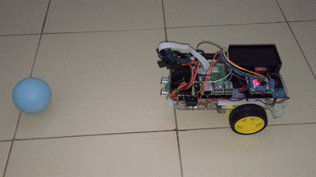
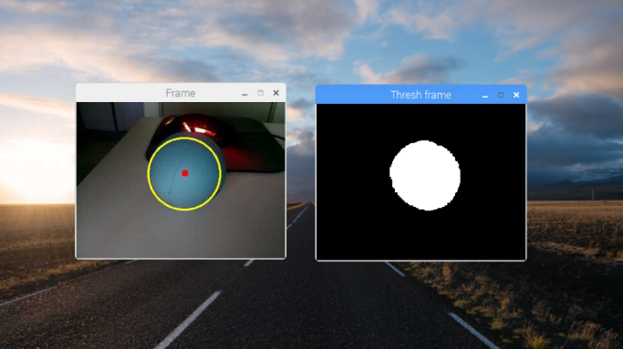

## RoboTrack - An Object Tracking Robot

This repository presents the design of a robot that can detect and closely follow a coloured ball. The automated robot is able to perform these tasks without any monitoring once the colour has been set. The proposed system includes a Raspberry Pi camera to feed the video frames to the Raspberry Pi where the image processing takes place. The colour of the object is extracted manually from the frame and a shape detector is applied to detect a circular object.

The robot also consists of a pan/tilt mechanism so that the movement of the camera can be controlled to keep the ball within its sight. As the ball gets nearer or further, the Raspberry Pi will send a signal to the motors to move either forward or backwards based on the position of the ball. If no object of the specified is found, the robot will enter a scanning mode where it continuously roams around and searches for the desired object.
